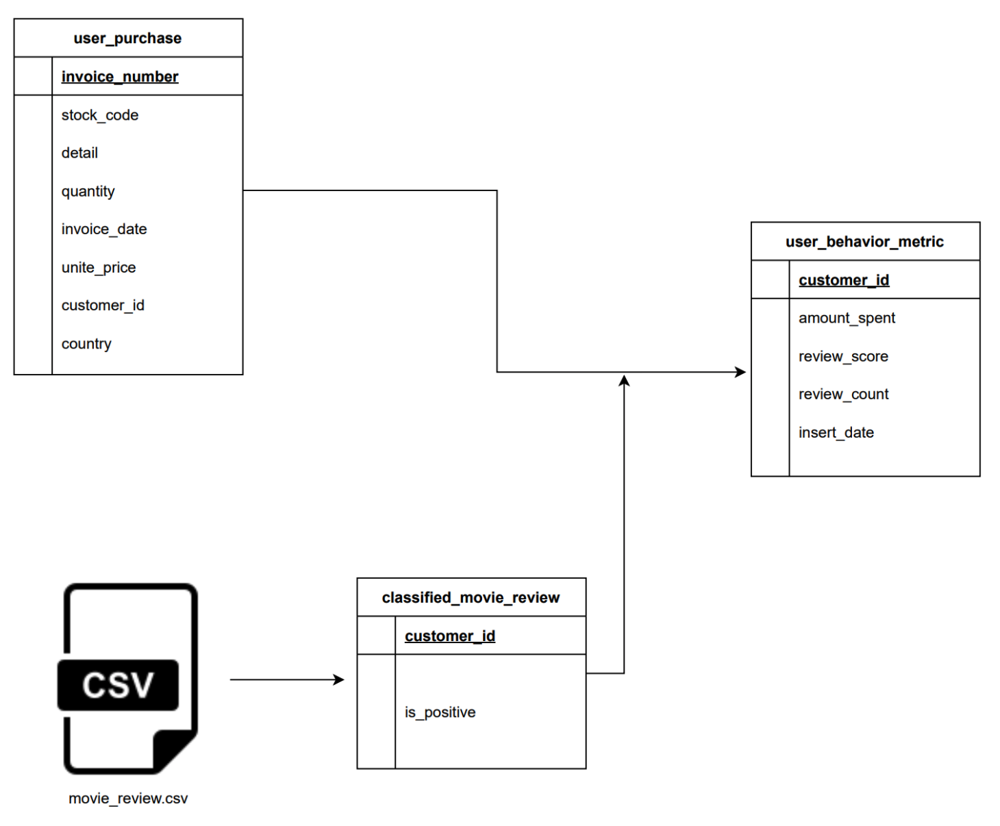
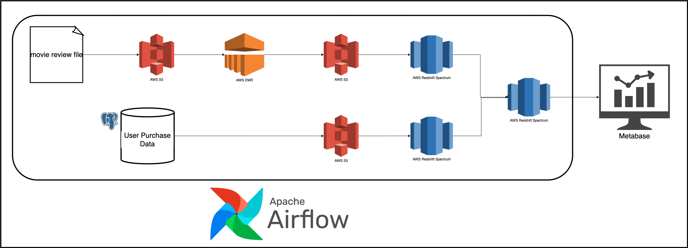

# Insight-Pipeline
Insight Pipeline is a data engineering project designed to build and manage a sophisticated batch data pipeline. This project serves as a hands-on platform for developing and refining my skills in handling large-scale data operations using cloud technologies and modern data engineering practices.

This project is designed to simulate a real-life data engineering scenario, providing hands-on experience with various technologies. The goal is to build an end-to-end data pipeline that processes and analyzes user behavior data. This project was implemented using Apache Airflow, AWS EMR, AWS Redshift, AWS Spectrum, and AWS S3. 

## Objective

The primary objective of this project is to create a data pipeline that populates the `user_behavior_metric` table for a user behavior analytics company. The data for this table is sourced from:

- `user_purchase`: An OLTP table containing user purchase information.
- `movie_review.csv`: Daily data provided by an external vendor.



## Technologies and Tools Used

### Apache Airflow

Airflow was used to orchestrate the entire data pipeline, ensuring tasks were executed in the correct order and handling dependencies between tasks.

### AWS EMR

EMR was utilized to process and classify movie review data using Apache Spark. EMR allowed for scalable data processing and seamless integration with other AWS services.

### AWS Redshift

Redshift served as the data warehouse where all processed data was stored. It enabled efficient querying and analysis of large datasets.

### AWS Spectrum

Spectrum was employed to query data stored in S3 directly from Redshift, providing a cost-effective solution for handling large volumes of data.

### AWS S3

S3 acted as the data lake, storing raw and processed data. It provided durable and scalable storage for all project data.

### Terraform

Terraform was used to provision and manage the AWS infrastructure, ensuring reproducibility and scalability of the setup.

### Metabase

Metabase was used for data visualization, providing an intuitive interface to create dashboards and reports from the processed data.

### Docker

Docker facilitated local development and testing by containerizing all services, ensuring consistency across different environments.

## Project Implementation

### Data Pipeline Design

The data pipeline was designed to perform the following tasks:

1. **Classify Movie Reviews**: Using Apache Spark on AWS EMR to classify movie reviews.
2. **Load Classified Reviews**: Loading the classified movie reviews into AWS Redshift.
3. **Extract User Purchase Data**: Extracting user purchase data from an OLTP database and loading it into Redshift.
4. **Generate User Behavior Metrics**: Joining classified movie reviews with user purchase data to generate user behavior metrics.



### Detailed Steps

1. **Classify Movie Reviews**:
    - Movie review data was copied from a local file to the S3 raw area.
    - A PySpark script was uploaded to S3.
    - EMR steps were added to the cluster to move raw data from S3 to HDFS, run the classification script, and move classified data back to S3.

2. **Load Classified Reviews**:
    - Classified movie reviews were loaded from S3 to Redshift using Spectrum.

3. **Extract User Purchase Data**:
    - Data was extracted from a Postgres database and copied to the S3 staging area.
    - Redshift Spectrum was used to load this data into Redshift.

4. **Generate User Behavior Metrics**:
    - SQL scripts were executed in Redshift to join user purchase data with classified movie reviews and generate metrics.

### Prerequisites

- GitHub account
- AWS account with necessary permissions
- Terraform installed
- AWS CLI configured
- Docker and Docker Compose installed

### Setup Instructions

1. **Clone the Repository**:
    ```bash
    git clone https://github.com/Liang95869417/Insight-Pipeline.git
    cd Insight-Pipeline
    ```

2. **Run Locally**:
    ```bash
    make up  # Start Docker containers and run migrations
    make ci  # Run auto-formatting, lint checks, and tests
    ```

3. **Deploy Infrastructure with Terraform**:
    ```bash
    make tf-init  # Initialize Terraform
    make infra-up  # Apply Terraform configuration
    ```

4. **Set Up Redshift Spectrum and Redshift Tables**:
    ```bash
    make spectrum-migration
    make redshift-migration
    ```

5. **Start Airflow and Metabase**:
    ```bash
    make cloud-airflow  # Forward Airflow port and open in browser
    make cloud-metabase  # Forward Metabase port and open in browser
    ```

6. **Retrieve Redshift Credentials**:
    ```bash
    make infra-config
    ```

### Data Visualization

Data processed by the pipeline was visualized using Metabase. A dashboard was created to display user behavior metrics, enabling easy analysis and insights.

### Cost Management

A cost estimation was done to ensure the infrastructure was cost-effective. The setup, using AWS services, was estimated to cost around $358.89 per month.

### Results and Validation

The processed data was validated by querying the `user_behavior_metric` table in Redshift. Results were also visualized in Metabase to ensure accuracy and completeness.

